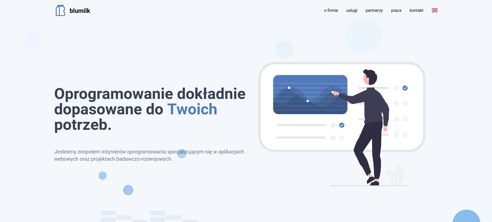

# blumilk-website
The source code of the website hosted under [https://blumilk.pl/](https://blumilk.pl/)



## Local development
Clone this repository with Git and go into the project's directory:
```
git clone https://github.com/blumilksoftware/website blumilk.pl
cd blumilk.pl
```

Install dependencies and create `.env` file based on example:
```
dcr node npm install
cp .env.example .env
```
Without the `.env` file properly filled, you won't be able to send a contact form and see the office location map.

Run ESLint and Mocha tests:
```
dcr node npm run lint
dcr node npm test
```
Run all Cypress tests:
```
docker-compose up cypress
```

Run Svelte development mode:
```
dcr node npm run dev
```

Please maintain our project guidelines:
* keep Issues well described, labeled and in English
* add issue number to all your commits
* add issue number to your branch name
* squash your commits into one commit with standardized name

> `dcr` should be an alias to `docker-compose run --rm -u "$(id -u):$(id -g)"`

## Deployment
GitHub Actions are configured to automatically publish all changes from `main` branch with all generated artifacts to `public` branch. GitHub Pages are configured to host built website.
